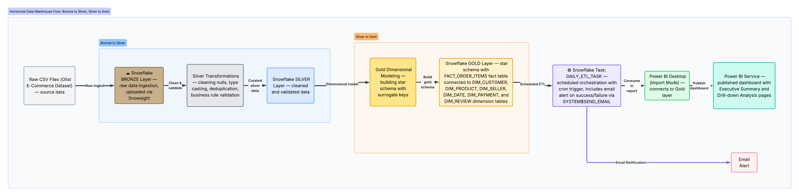
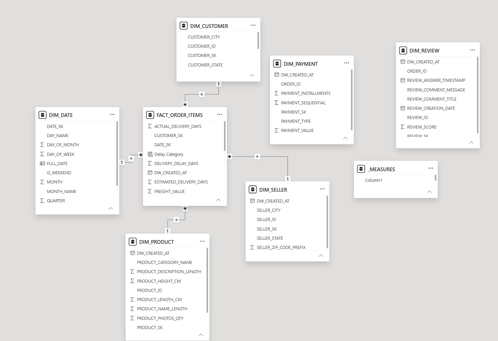
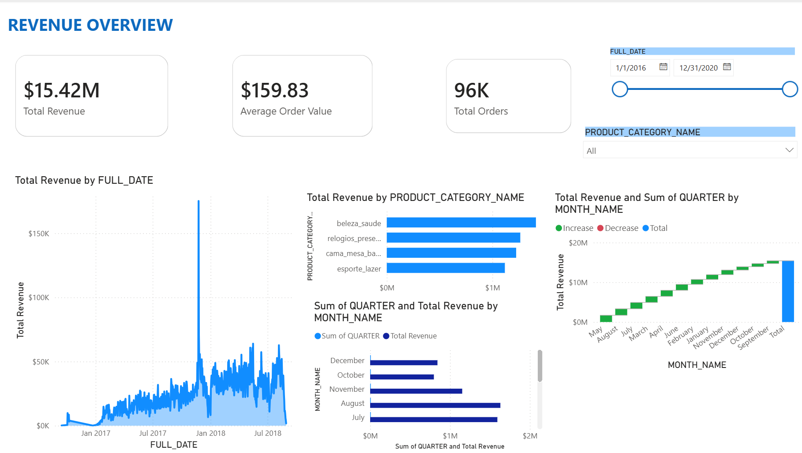
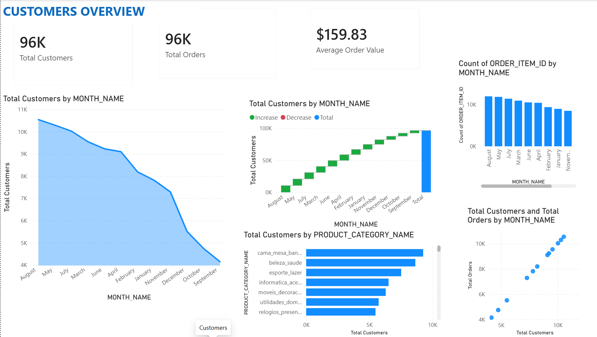
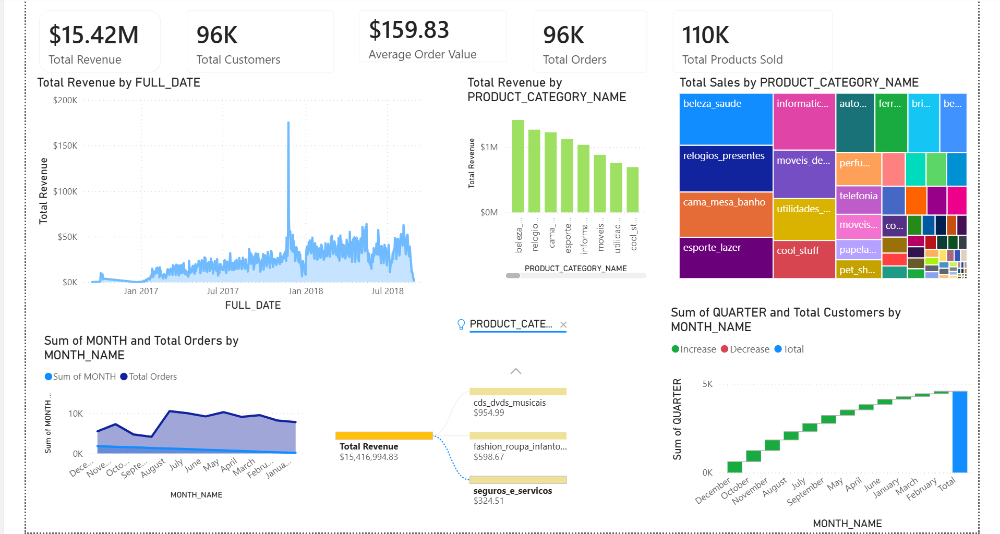

# Olist E-Commerce Data Warehouse (Snowflake + Power BI)

## Overview
This project implements a Bronze-Silver-Gold (Medallion architecture) 
data warehouse for the Olist Brazilian e-commerce dataset, transforming 
raw transactional data into a dimensional star schema and visualizing 
it through interactive Power BI dashboards.

**Tech Stack:** Snowflake (data warehouse + orchestration), SQL, Power BI 
Desktop & Service (visualization). Built as an internship project 
following a 4-week roadmap originally designed for Azure/Databricks, 
adapted to Snowflake with mentor approval.

## Business Questions
This project answers:
1. What is total revenue, order volume, and average order value over time?
2. Which product categories drive the most revenue and sales volume?
3. How does customer acquisition trend month over month?
4. What is the relationship between delivery delays and customer 
   satisfaction (review scores)?
5. How do orders and revenue vary seasonally across quarters?

## Dataset
**Source:** Olist Brazilian E-Commerce Public Dataset (Kaggle), 
~100K orders across 9 raw tables (orders, customers, products, sellers, 
order items, payments, reviews, geolocation, category translation).

## Architecture

The pipeline follows the Medallion architecture:
- **Bronze:** Raw CSV files loaded as-is into Snowflake via Snowsight, 
  preserving original structure for traceability.
- **Silver:** Cleaned, type-cast, deduplicated, and validated against 
  business rules (e.g., price > 0, valid order statuses, delivery 
  date logic).
- **Gold:** Dimensional star schema — one fact table and six conformed 
  dimensions, ready for BI consumption.
- **Orchestration:** A Snowflake Task runs the full pipeline daily on 
  a cron schedule, with automated email alerts on success or failure.

## Star Schema


**Grain:** One row per order line item.

**Fact table:**
- `FACT_ORDER_ITEMS` — price, freight value, total amount, actual vs. 
  estimated delivery days, delivery delay days

**Dimensions:**
- `DIM_CUSTOMER` (SCD Type 1 — city/state updates overwrite in place)
- `DIM_PRODUCT`
- `DIM_SELLER`
- `DIM_DATE`
- `DIM_PAYMENT`
- `DIM_REVIEW`

## Data Quality & Business Rules
During Silver layer processing, the following issues were identified 
and resolved:
- **Duplicates:** REVIEWS (99,224 total → 98,410 distinct review_id) 
  and PAYMENTS (103,886 total → distinct on order_id + 
  payment_sequential) — resolved via `ROW_NUMBER()` deduplication, 
  keeping the most recent record.
- **Nulls:** PRODUCTS, REVIEWS, and ORDERS contained null values, 
  handled via `COALESCE()` defaults or filtering incomplete order 
  lifecycle records.
- **Business rule validation:** price > 0, freight_value >= 0, valid 
  order_status values, payment_value > 0, delivery dates >= purchase 
  dates, review_score between 1-5.

## Setup Steps
1. Create a Snowflake database with BRONZE, SILVER, and GOLD schemas.
2. Upload raw Olist CSVs into BRONZE schema tables via Snowsight's 
   data loading wizard.
3. Run `SQL/etl_pipeline.sql` to build Silver transformations and the 
   Gold dimensional model.
4. The `RUN_ETL_PIPELINE()` stored procedure encapsulates the full 
   Silver + Gold refresh logic, with success/failure email 
   notifications via `SYSTEM$SEND_EMAIL`.
5. `DAILY_ETL_TASK` schedules the procedure via cron 
   (`0 6 * * * UTC`) for daily automated refresh.
6. Connect Power BI Desktop to the Snowflake GOLD schema (Import mode).
7. Open `powerbi/internship1.pbix` to view/edit the report, or publish 
   to Power BI Service.

## Dashboard Pages

### Revenue Overview
KPI cards (Total Revenue, Average Order Value, Total Orders), 
revenue trend over time, revenue by product category, and 
cumulative revenue by month.


### Customers Overview
Customer acquisition trend, cumulative customer growth, customer 
breakdown by product category, and order-volume correlation.


### Sales Overview
KPI summary, revenue by date and category, category-level sales 
treemap, and revenue decomposition by category drill-through.


## Sample SQL Queries
See `SQL/etl_pipeline.sql` for the complete pipeline. Key examples include:
- Data quality checks (null counts, duplicate detection per table)
- Business rule filters (price, payment value, delivery date logic, 
  review score range)
- Star schema construction with surrogate keys (`MD5()` hashing, 
  `AUTOINCREMENT`)
- SCD Type 1 implementation on `DIM_CUSTOMER` via `MERGE`
- Aggregate analysis: total revenue by product category per year, 
  average delivery delay by category

## Orchestration & Monitoring
The pipeline runs automatically once per day via `DAILY_ETL_TASK`, 
calling `RUN_ETL_PIPELINE()`. On completion, an email is sent 
confirming success; on failure, an email with the captured error 
message (`SQLERRM`) is sent instead, enabling fast troubleshooting 
without manually checking Snowflake.

## Project Structure
```
olist-data-warehouse/
├── README.md
├── SQL/
│   └── etl_pipeline.sql
├── Diagrams/
│   ├── Architecture diagram.png
│   └── Star Schema.png
├── Screenshots/
│   ├── Revenue.png
│   ├── Customers.png
│   └── Overview.png
└── powerbi/
    └── internship1.pbix
```